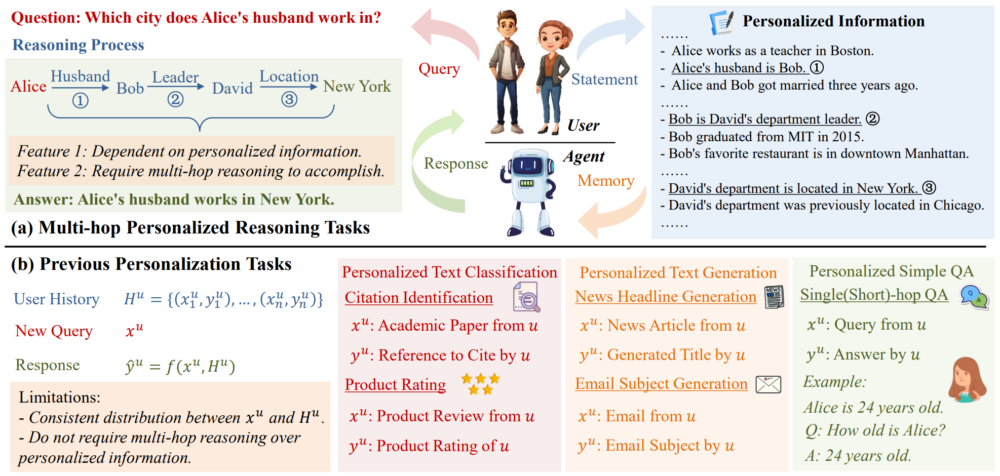
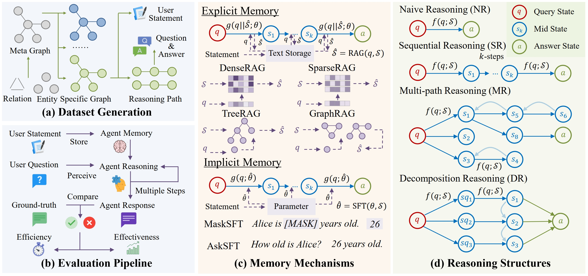

# Explicit v.s. Implicit Memory: Exploring Multi-hop Complex Reasoning Over Personalized Information

## Introduction
Memory serves as a crucial component for achieving agent personalization, responsible for storing and utilizing personalized information of users.
While previous research has proposed memory approaches to enhance personalization, they typically focus on user alignment or single-hop question answering, overlooking the importance of multi-hop personalized reasoning.
In real-world applications, complex tasks often require integrating multiple pieces of user information through multi-hop reasoning, which poses significant challenges for current memory mechanisms.
To address this gap, we propose the multi-hop personalized reasoning task to investigate different memory mechanisms in multi-hop reasoning on personalized information.
We explicitly define this task and construct a dataset along with a unified evaluation framework.
We implement various explicit and implicit memory methods to conduct comprehensive experiments. We explore their performance on this task from multiple perspectives and analyze their advantages and limitations.
We further explore hybrid approaches that combine both paradigms and propose the HybridMem method to address their limitations.
We demonstrate the effectiveness of our proposed model through experiments.



## Major Contributions
- We identify and analyze MPR tasks, highlighting their unique challenges for agent memory compare with previous works.
- We formally define MPR tasks and construct a new dataset with a unified evaluation framework for systematically exploring different memory methods under MPR tasks.
- We conduct comprehensive experiments on explicit, implicit, and hybrid memory approaches, presenting key findings and proposing a new hybrid memory method for long-hop reasoning tasks.



## Run Experiments

### Step 1: Prepare the Environment

Create an environment with Conda.
```bash
conda create -n mpr_env python=3.9
```

Activate the environment.
```bash
conda activate mpr_env
```

Clone/Dowload the repository source.

```bash
git clone https://github.com/nuster1128/MPR.git
```

Install the packages.
```bash
cd MPR
pip install -r requirements.txt
```

Dowload the [MPR Dataset](https://drive.google.com/file/d/1a0Ya9buk1I0hsGoaRX8bW0QJjsKuN4FR/view?usp=sharing) and unzip it.
```bash
unzip mpr_dataset.zip
```

Download the checkpoint of LLM and Sentence Embedding model.

You may refer to [Qwen2.5-7B](https://huggingface.co/Qwen/Qwen2.5-7B) and [E5-base-v2](https://huggingface.co/intfloat/e5-base-v2).

### Step 2: Config the Model

Please edit the config file `config.py` to set the proper experiment settings.

#### Step 2.1: General Settings

Fill out the following paths of model checkpoints and the project.
```python
Qwen_2_5_7B_model_path = '[MODEL_PATH]'
E5_base_v2_model_path = '[MODEL_PATH]'
Root_dir = '[PROJECT_ROOT_PATH]'
```
Besides, fill out the port and address if using API of LLMs.

#### Step 2.2: Dataset Settings
Fill out the path of evaluated datasets.
```python
environment_config = {
    'data_title': '[DATA_TITLE]',
    'data_path_dir': '[DATA_DIR_PATH]'
}
```

#### Step 2.3: Memory Settings
Fill out the settings of memory mechanisms.

#### Step 2.4: Reasoning Settings
Fill out the settings of reasoning structures.

### Step 3: Run the Program
Run the program with the commands like the following one.
```bash
nohup python -u run_qa.py Naive DenseRAG > logs/Naive-DenseRAG.log 2>&1 &
```

You may change `Naive` to other reasoning structures as follows:

- `Naive`: Naive Reasoning (NR).
- `Sequential`: Sequential Reasoning (SR).
- `Structured`: Multi-path Reasoning (MR).
- `Decomposition`: Decomposition Reasoning (DR).

You may change `DenseRAG` to other memory mechanisms referred in `config.py`.

### Citation
```
[TBD]
```